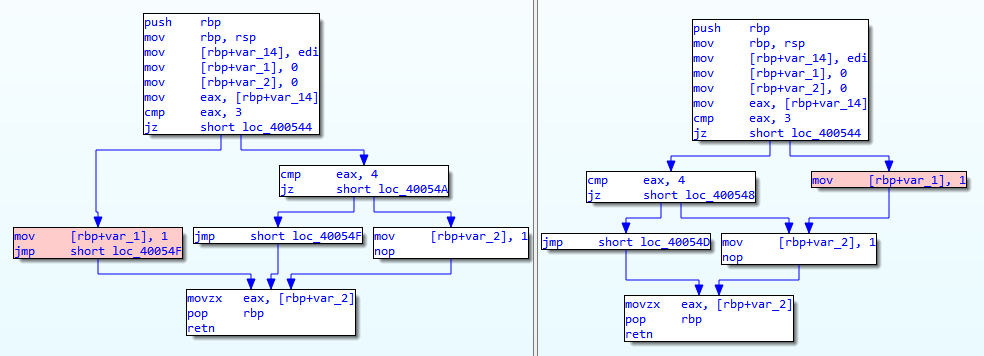

# Weakest Precondition Analysis (WP)

The weakest precondition analysis consists of two parts.

* A weakest precondition [OCaml library](./lib/bap_wp), which can be installed and used on its own for general weakest precondition analysis.

* A weakest precondition [BAP plugin](./plugin), which provides a convenient command line interface to the just mentioned weakest precondition library.

## Build/install/test

If you like, you can install the library independently (see the [README](./lib/bap_wp/README.md)). But the easiest way to get started is just to install both. A `Makefile` is provided in this directory, for that purpose.

Before installing, make sure you have the appropriate dependencies installed. First, there is OCaml:

    - ocaml 4.07.0

Then, there are the following OCaml packages:

    - core_kernel 0.12.4+
    - bap 2.1.0
    - ounit 2.0.8
    - z3 4.8.8
    - re 1.9.0

All of these can be installed with:

    opam install package_name

Then, to build and install the weakest precondition tools, simply run `make` from this directory:

    make

To uninstall and clean:

    make clean

To run oUnit tests:

    make test

## Example

Take the following C code:

```
#include <assert.h>

int main(int argc,char ** argv) {


  if(argc == 3)
    assert(0);


  return 0;
}

```

Compile with

> gcc -g -o my_exec my_code.c

And then invoke the bap plugin with

> bap my_exec --pass=wp

You should get an output which includes something like the following:

```
SAT!
Model:
    RDI  |->  #x000000000000003
```

Given that the `argc` argument is kept in the `RDI` register on
`X86_64` architectures, this give us possible input register values to
reach the `assert(0)` statement on line 7 of the source.

Changing line 6 to
```
if((argc == 3) && (argc != 3))
```

results in

```
UNSAT!
```

Meaning there is no way to reach the `assert(0)` statement.

Alternatively one may assert custom assumptions specified as smt-lib expressions
via the command line option `--wp-precond="(assert (= RDI #x0000000000000002))"`

-------

A more sophisticated example involves comparing two different
programs, in order to prove or refute functional equivalence of
subroutines.

We create 2 similar C programs:

`main_1.c`:
```
#include <stdbool.h>
#include <stdio.h>

typedef enum {SURFACE, TEST, RECORD, NAV, DEPLOY, LOG_STATUS} status_t;

bool process_status(status_t status) {
  bool nav = false;
  bool log = false;
  bool deploy = false;

  switch (status) {
    case NAV:
      nav = true;

    case LOG_STATUS:
      log = true;
      break;

    case DEPLOY:
      deploy = true;
      break;
  }
  return deploy;
}

int main() {

  status_t status = NAV;

  if (process_status(status)) {
    printf("Payload deployed.\n");
  }

  return 0;
}

```

and `main_2.c`:
```
#include <stdbool.h>
#include <stdio.h>

typedef enum {SURFACE, TEST, RECORD, NAV, DEPLOY} status_t;

bool process_status(status_t status) {
  bool nav = false;
  bool deploy = false;

  switch (status) {
    case NAV:
      nav = true;

    case DEPLOY:
      deploy = true;
      break;
  }
  return deploy;
}

int main() {

  status_t status = NAV;

  if (process_status(status)) {
    printf("Payload deployed.\n");
  }

  return 0;
}

```

So, `main_2.c` simply removes the `LOG_STATUS` case in the
`process_status` function, and in the enum.

As one might already notice, there is no break statement after the
`NAV` case, in which case the fall-through will create different
semantics for the return value.

To invoke `wp` on pairs of binaries, it is necessary to compile
each C file, and then call the `save-project` pass which creates a
serialized form of the decompiled code. To do this, invoke:

> gcc -g -o main_1 main_1.c

and

> gcc -g -o main_2 main_2.c

and then

> bap --pass=save-project main_1 && bap --pass=save-project main_2

which should create the `main_1.bpj` and `main_2.bpj` serialized files.

One can then invoke the `wp` plugin to compare the functional
behavior of that function, using the invocation:

> bap dummy_binary --pass=wp --wp-compare=true --wp-file1=main_1.bpj --wp-file2=main_2.bpj --wp-function=process_status

Where `dummy_binary` is any valid binary file, it will be
ignored. Note that we pass in the function name we are interested in,
here `process_status`.

This gives a result including many assignments to registers and
variables in the decompiled code, which should include something along
the lines of:

```
RBP  |->  #x000000000000000
ZF   |->  #b0
RDI  |->  #x000000000000003
```
As in the single program example, this gives values for registers
which exercise unwanted behavior. In this case, invoking
`process_status` with these register values will give different
outputs depending on whether `main_1` or `main_2` is invoked, which is
unsurprising given that `RDI` is the input value, and `3` is the
numerical value corresponding to the `NAV` case.

One can fix this difference, by adding a break statement after the
`NAV` case in `main_2.c`:

```
case NAV:
  nav = true;
  break;
```

And a similar invocation of bap will indeed give `UNSAT`, meaning that
the return values are always identical for identical inputs.

This plugin can also supplement current binary diffing tools to not
only identify code reuse between binaries but also understand the
implications and causes of their nuanced differences in behavior.

Binary diffing is the primary technique for identifying code reuse,
which is heavily used in disciplines such as malware attribution,
software plagiarism identification, and patch identification.

Current binary diffing tools only provide clues as to what is changed,
but not why or how the change manifests. For example,
[Diaphora](https://github.com/joxeankoret/diaphora) gives users percentage
scores on how closely functions between binaries match as well as how
closely the basic blocks within a function match. Those details are
helpful to identify what is changed, but most of the time, users want to
know more.

For malware attribution and software plagiarism identification, users
will want to also know if the detected similarities are authentic.
False positive identifications are not uncommon. Multiple functions
can have similar control-flow structure and instructions distribution.
For authenticity, we have to check the disassembly to see whether the
similarities are out of sheer luck, compiler-specific patterns, or
if it is actually legitimate.

For patch identification, we might not only want to identify the
specific patch but also the specific bug or vulnerability that warrants
the patch.

For all 3 cases, a certain level of program understanding is required.
With just the current binary diffing tools, the final stretch of program
understanding is left to the end users. But supplemented with the wp plugin,
the final stretch can be simplified and achieved quicker.

Below is an image showing Diaphora's diffing output for the `process_status` function:



It highlights in red the basic block that differs between the two similar
functions. But if users want to understand the implications and what causes
the change, they will have to manually reason about the surrounding basic
blocks, or at worst, reason about the function's inter-procedural dependencies
like callers and callees. This pass assists users in reasoning the causes and
implications by providing register states that lead to the disparating behaviors.
The outputted register states will help answer the 'cause' question. And with
'cause' question answered, users can narrow the scope of code that they need
to analyze to understand the implications since they can be confident that
nothing else is causing those changes.

## Invocation

Use the bap CLI:

To view the man page:

    bap wp --help

To find the precondition of a subroutine:

    bap wp \
      [--func=function_name] \
      [OPTIONS] \
      -- /path/to/exec

To compare two binaries:

    bap wp \
      [--func=function_name] \
      [OPTIONS] \
      -- /path/to/exe1 /path/to/exe2

The various options are:

- `--func=function_name`. Determines which function to
  verify. `wp` verifies a single function, though calling it on
  the `main` function along with the `inline` option will analyze the
  whole program. If no function is specified or the function cannot be found
  in the binary/binaries, the analysis will fail.

- `--precond=smt-lib-string`. If present, allows the introduction of assertions
  to the beginning of a query. This allows pruning of possible models. For
  comparative predicates, one may refer to variables in the original and
  modified program by appending the suffix "_orig" and "_mod" to variable names
  in the smt-lib expression. For example, `--precond="(assert (= RDI_mod #x0000000000000003)) (assert (= RDI_orig #x0000000000000003))"`.

- `--postcond=smt-lib-string`. If present, replaces the default postcondition
  by the user-specified one, using the [smt-lib2] format. Similar to
  `--precond`, one may create comparative postconditions on variables by
  appending "_orig" and "_mod" to register names.

- `--trip-asserts=[true|false]`. If set, WP will look for inputs to the
  subroutine that would cause an `__assert_fail` to `__VERIFIER_error` to be
  reached.

- `--check-null-derefs=[true|false]` If present, in the case of a single binary
  analysis, WP will check for inputs that would result in dereferencing a NULL
  address during a memory read or write. In the case of a comparative analysis,
  WP will check that the modified binary has no additional null dereferences in
  comparison with the original binary.

- `--compare-func-calls=[true|false]`. Determines whether to compare
  the semantics of two programs by comparing which subroutines are invoked in
  the body of the function. `false` by default.

- `--compare-post-reg-values=reg_list`. This flag is used for a comparison
  analysis. If set, WP will compare the values stored in the specified registers
  at the end of the analyzed function's execution. For example, `RAX,RDI`
  compares the values of RAX and RDI at the end of execution. If unsure about
  which registers to compare, x86_64 architectures place their output in RAX,
  and ARM architectures place their output in R0.

- `--inline=posix-re`. Function calls to inline as specified by a POSIX
  regular expression.  If not inlined, heuristic function summaries are used at
  function call sites. For example, if you want to inline everything, set to
  --inline=.\* or if you want to inline functions foo and bar, set to
  --inline=foo|bar.

- `--num-unroll=num`. If present, replaces the default number of
  times to unroll each loop. The number of loop unrollings is 5 by default.

- `--gdb-output=my_exec.gdb`. Output a gdb script to file `my_exec.gdb`. From
  within gdb, run `source my_exec.gdb` to set a breakpoint at the function given
  by `--func` and fill the appropriate registers with a found counter-model.

- `--bildb-output=filename.yml`. Output a BilDB initialization script to file
  `filename.yml`. This YAML file sets the registers and memory to the values
  specified in the countermodel found during WP analysis, allowing BilDB to
  follow the same execution trace. In the case the analysis returns UNSAT or
  UNKNOWN, no script will be outputted.

- `--use-fun-input-regs=[true|false].` If present, at a function call site, uses
  all possible input registers as arguments to a function symbol generated for
  an output register that represents the result of the function call. If set to
  false, no registers will be used. Defaults to true.

- `--mem-offset=[true|false]`. If present, at a memory read, adds an assumption
  to the precondition that the memory of the modified binary is the same as the
  original binary at an offset calculated by aligning the data and bss sections.
  We do this by invoking `objdump` on both binaries, and determining the starting
  addresses of the symbols in these sections. If this flag is set to false, we
  assume that memory between both binaries are equal during a memory read.

- `--debug=[z3-solver-stats|z3-verbose|constraint-stats|eval-constraint-stats]
  or some comma delimited combination`. A list of various debugging statistics
  to print out during the analysis. Multiple options as a list can be passed
  into the flag to print multiple statistics. For example:
  `--debug=z3-solver-stats,z3-verbose`. The options are:
  - `z3-solver-stats`: Statistics about the Z3 solver including information such
    as the maximum amount of memory and number of allocations.
  - `z3-verbose`: Increases Z3's verbosity level to output information during
    the precondition check time including the tactics the solver used.
  - `constraint-stats`: Prints out the number of goals, ITES, clauses, and
    substitutions in the constraint data type of the precondition.
  - `eval-constraint-stats`: Prints out the mean, max, and standard deviation of
    the number of subsitutions that occur during the evaluation of the
    constraint datatype.

- `--show=[bir|refuted-goals|paths|precond-internal|precond-smtlib]`. A list
  of details to print out from the analysis. Multiple options as a list can be
  passed into the flag to print out multiple details. For example:
  `--wp-show=bir,refuted-goals`. The options are:
   - `bir`: The code of the binary/binaries in BAP Immediate Representation.
   - `refuted-goals`: In the case the analysis results in SAT, a list of goals
      refuted in the model that contains their tagged names, the concrete values
      of the goals, and the Z3 representation of the goal.
   - `paths`: The execution path of the binary that results in a refuted goal.
     The path contains information about the jumps taken, their addresses, and
     the values of the registers at each jump. This option automatically prints
     out the refuted-goals.
   - `precond-internal`: The precondition printed out in WP's internal format
     for the Constr.t type.
   - `precond-smtlib`: The precondition printed out in Z3's SMT-LIB2 format.

- `--stack-base=address`. If present, sets the base or top address of the stack.
  By default, WP places the stack at a base address of 0x40000000.

- `--stack-size=size`. If present, sets the size of the stack. `size` should
  be denoted in bytes. By default, the size of the stack is 0x800000, which is
  8Mbs.

## C checking API

There is a `cbat.h` file in the `api/c` folder which contains headers
for functions which `wp` handles specially. These are taken to
be identical as in the SV\_COMP competition, and contain a reference
implementation representing their semantics (which is not actually used by the
tool, though).

These can be used to verify certain properties, e.g. a call
```
if (p == NULL) { __VERIFIER_error(); }
```
will check whether `p` may take a `NULL` value. Similarly,

```
char c = __VERIFIER_nondet_char();
```
will assume an unknown value for variable `c`.


## Logging

By default, logs are printed to `STDERR`. You can save the logs to a file by specifying a log directory with the `--log-dir` flag or exporting the `$BAP_LOG_DIR` environment variable.

By default, `debug` logs are not shown. To show debug logs:

    export BAP_DEBUG=true

